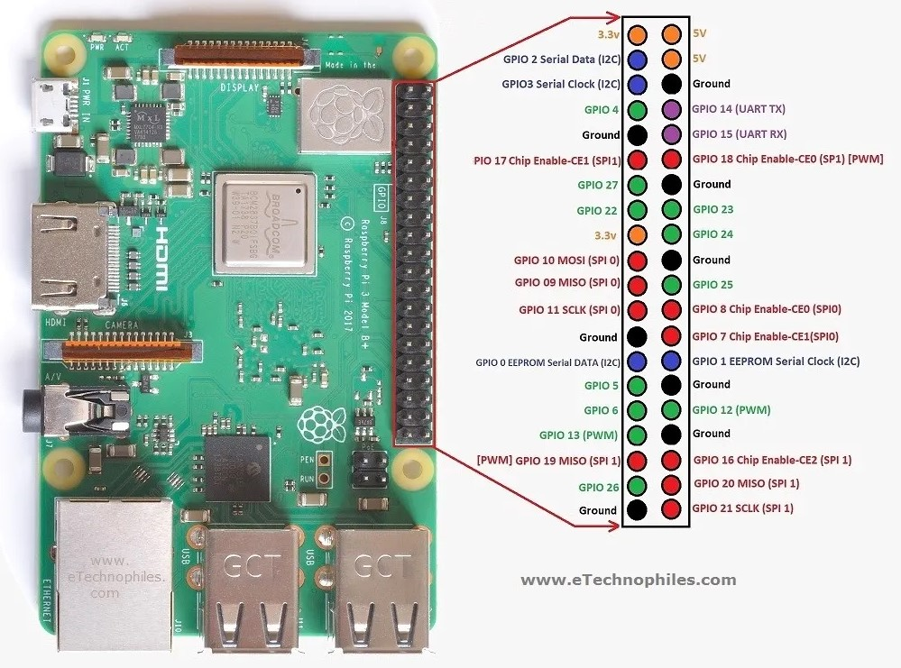
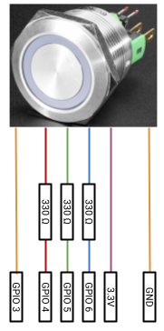
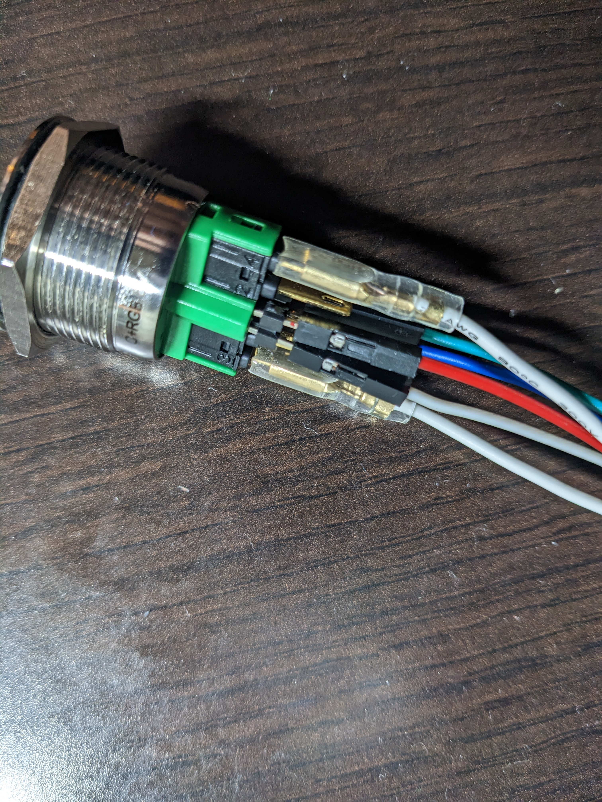
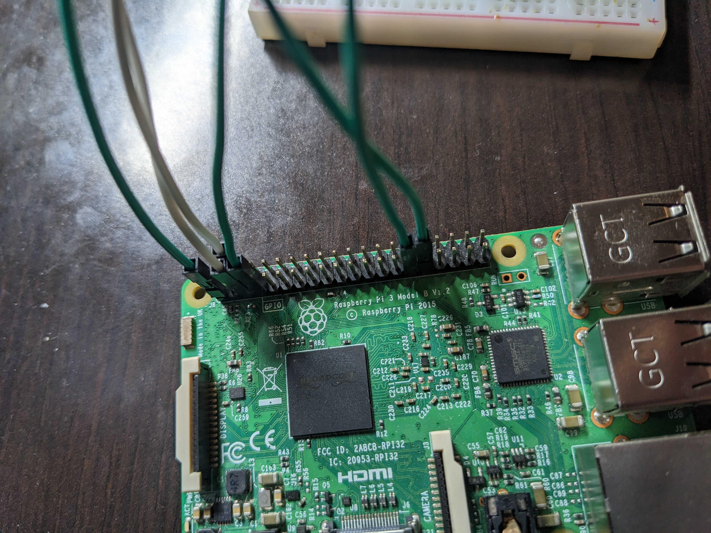

# Raspberry Pi Power Button 
:joy:
## Overview
The main goal of this project is to have an easy way to safely power on and power off the raspberry pi with a physical button. The button used in this project has an RGB LED to show the current state of the Raspberry Pi to the user. This project has only been tested using **Ubuntu Server 22.04 LTS (64-bit)** and the hardware specified in the [hardware](#hardware) section.

To use this program, please recreate the [circuit](#circuit) using the [hardware](#hardware) shown below then [install](#install--uninstall) the files found in the source (src) folder.


| Color | Process |
| :-: | :-: |
| Red | Operating System Starting Up |
| Green | Start Up Complete; Button Ready to Use |
| Yellow | Operating System Restarting |

<br>

| Action | Outcome |
| :-: | :-: |
| Button Press & Release (< 1 seconds) | Shutdown |
| Button Press & Release (> 1 seconds) | Restart |


<!-- Include gif here -->

___
## Table of Contents
- [Hardware](#hardware)
- [Circuit](#circuit)
- [Install & Uninstall](#install--uninstall)
- [Final Thoughts](#final-thoughts)
- [Acknowledgments](#acknowledgments)
- [Resources](#resources)

___
## Hardware
The following material was used to complete the project:
| Item | Price |
| ---- | ----  |
| [Raspberry Pi 3 B+](https://www.raspberrypi.com/products/raspberry-pi-3-model-b-plus/) | $ 35|
| [16GB Micro SD Card](https://www.amazon.com/SanDisk-Ultra-Micro-Adapter-SDSQUNC-016G-GN6MA/dp/B010Q57SEE/ref=sr_1_5?crid=NDJPC0XCM98L&keywords=16+gb+micro+sd+card&qid=1674353222&sprefix=16+gb+micro+sd+car%2Caps%2C123&sr=8-5) | $ 9|
| [USB Micro Power Supply](https://www.amazon.com/CanaKit-Raspberry-Supply-Adapter-Listed/dp/B00MARDJZ4/ref=sr_1_3?crid=1WLOJVTCLHJZZ&keywords=raspberry+pi+charger&qid=1674353391&sprefix=raspberry+pi+charge%2Caps%2C134&sr=8-3) | $ 10|
| [Dupont Wires](https://www.amazon.com/Elegoo-EL-CP-004-Multicolored-Breadboard-arduino/dp/B01EV70C78/ref=sr_1_4?crid=13NN9HC49LN7Y&keywords=dupont%2Bwires&qid=1674353440&sprefix=dupont%2Bwires%2Caps%2C130&sr=8-4&th=1) | $ 7|
| [Resistors](https://www.amazon.com/BOJACK-Values-Resistor-Resistors-Assortment/dp/B08FD1XVL6/ref=sr_1_3?crid=3N7Y3ASG0MWLY&keywords=resistors&qid=1674353543&sprefix=resistor%2Caps%2C126&sr=8-3&th=1) | $ 11|
| [Spade Connectors](https://www.amazon.com/dp/B0972WQZVD?ref=ppx_yo2ov_dt_b_product_details&th=1) | $ 9|
| [Wire Crimper](https://www.amazon.com/dp/B0873Y19T7/ref=syn_sd_onsite_desktop_372?ie=UTF8&pd_rd_plhdr=t&th=1) | $ 27| 
| [LED Power Button](https://www.adafruit.com/product/3423) | $ 17|
| [18 AWG Solid Wire](https://www.amazon.com/TUOFENG-Wire-Solid-different-colored-spools/dp/B085QD9DWP/ref=sr_1_7?crid=1XK2AK3TA47WP&keywords=18%2Bawg%2Bwire&qid=1674353671&s=hi&sprefix=18%2Bawg%2Bwir%2Ctools%2C115&sr=1-7&th=1) | $ 17|
| [Breadboard](https://www.amazon.com/EL-CP-003-Breadboard-Solderless-Distribution-Connecting/dp/B01EV6LJ7G/ref=sr_1_5?keywords=arduino%2Bbreadboard&qid=1674353765&sr=8-5&th=1) | $ 10|
| [Wire Cutters](https://www.amazon.com/Klein-Tools-Cutter-Stripper-Stranded/dp/B00080DPNQ/ref=sr_1_39?crid=2QVT65YE5M13T&keywords=wire%2Bcutters&qid=1674353794&sprefix=wire%2Bcutter%2Caps%2C152&sr=8-39&th=1) | $ 20|

*Note: The links provided are only suggestions. They are not the only options for purchasing these specific products. I do not have any affiliation with the companies selling these products. The prices shown now may not be up to date.* <br><br>
*Note: A Micro SD to USB A converter may be needed if the computer you're going to use to flash the operating system does not have a SD card slot.*

___
## Circuit & Setup
Notes: 
- The LED in the power button is a common anode RGB. This means that the three LEDs share a positive connection.   
- From the LED Power Button, the wire going to GPIO 3 and the wire going to ground (GND) are both for the button. They need to be connected to the normally open (NO) spade connectors on the button, which are the two outermost connectors. A drawing can be found [here](https://cdn-shop.adafruit.com/product-files/3423/C5325+datasheet+PM221-11E-42RGB-12V-S.pdf) or on the [LED Power Button](https://www.adafruit.com/product/3423) product webpage.   
<br>


<p align="center">
  
</p>    

<p align="center">
  
</p>

<p align="center">
  
</p>

<p align="center">
  
</p>

___
## Install & Uninstall
*Note: The first step assumes that the user has already installed Ubuntu 22.04 LTS (64-bit) on their Raspberry Pi micro SD card. I recommend using the [Raspberry Pi Imager](https://www.raspberrypi.com/software/).    
Also, please complete the circuit above before beginning this section.*

1. First, please update your operating system using the following commands:   
```bash
sudo apt update && sudo apt upgrade
```

*Note: This can take some time depending on how updated your operating system is currently. Consider restarting after this command is finished.*

2. In order to install the installation file, please install curl using the following command:
```bash
sudo apt-get install curl
```

3. The program uses Python 3 and the GPIO Zero module
Please run the next two commands to install both of them:   
```bash
sudo apt-get install python3   
sudo apt-get install python3-gpiozero   
```

4. To install the program, please run the installation file:   
```bash
curl https://raw.githubusercontent.com/josephgalloway321/raspberry_pi_power_button/main/src/install.sh | bash
```

*Note: If everything installed correctly, the shell will print "Installation complete. Please restart your device." The LED will also turn green.*

5. Please restart your device using the following command:
```bash
reboot
```

Once the operating system completes restarting, the system should be ready to use. 

___
Run the following command to see if the service is actively running:
```bash
systemctl status power_button.service
```

To Uninstall, please run the uninstallation file:    
```bash
curl https://raw.githubusercontent.com/josephgalloway321/raspberry_pi_power_button/main/src/uninstall.sh | bash
```

___
## Final Thoughts
I learned so much completing this project. In addition to adding a convenient power button to my Raspberry Pi, I learned about bash scripting, systemd, and mechatronics. I intend on using this project in combination with my future robotics projects. I also plan on updating the project to work on different operating systems, different hardware, and a YouTube video walking viewers through recreating the project themselves. 

Please let me know if this project helped in any way! I'd really appreciate any feedback or how someone improved upon this design. I would also really appreciate credit if this project helped.  

___
## Acknowledgments
The credit for all of the information in this project goes to the people who made the content in the resources section below. They were all excellent resources and guides for this project. I'm very grateful and could not have done it without their help.

___
## Resources
- [Raspberry Pi 3B+ Image Source](https://www.etechnophiles.com/raspberry-pi-3-b-pinout-with-gpio-functions-schematic-and-specs-in-detail/)

[Top of the page](#raspberry-pi-power-button)